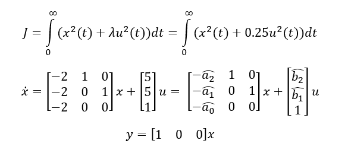
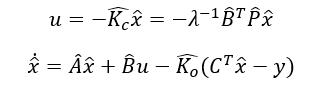
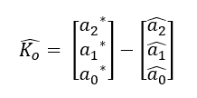
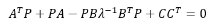
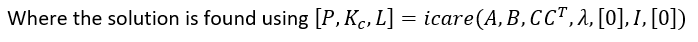
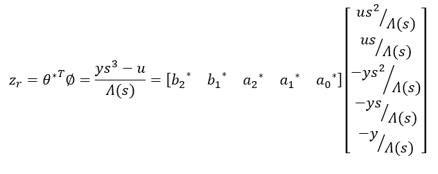

# LQR_Control_and_Luenberger_with_Least_Squares
Adaptive Linear Quadratic Control and Luenberger Observer (using Least-Squares)

The LQR cost function is:

The LQR designed control input with an Adaptive Luenberger Observer is as follows:

Where the solution found using the Riccatti equation:

The Adaptive Luenberger Observer uses a Least-Squares estimator with forgetting factor and normalization. The reduced parametric model is as follows:

In our simulation we place our observer poles at -4. The plant is controllable and observable, however, it is unstable which implies that the open-loop system poles are in the open right hand plane. 

There is no guarantee that one can find a lambda such that the closed loop poles are equal to the roots of a desired polynomial A*, rather LQ control design is used only to ensure that the closed loop system has good robustness properties meaning that the closed loop eigenvalues are in the open left hand side of the plane. 

The location of the closed loop system poles (A-BKc) depends on the choice of lambda. A low value of lambda corresponds to low cost control and implies that the input u may become unbounded. A higher value of lambda (high cost control) is required to ensure that the input ‘u’ is bounded. However, since the plant is unstable (the open loop system is unstable), the value of lambda can not be too high. For example, changing lambda to a value of 1 results in a bounded input ‘u’ and convergence of y(t)->0. On the other hand making lambda small (=0.01) results in ‘u’ becoming unbounded. The value of lambda = 0.25 (as in our simulation) results in converging state and parameter estimates suggesting that the ALQC successfully places the closed loop poles in the left hand plane. The output of the LQR controller converges to zero as the closed loop poles (of (A-BKc)) are made stable.
